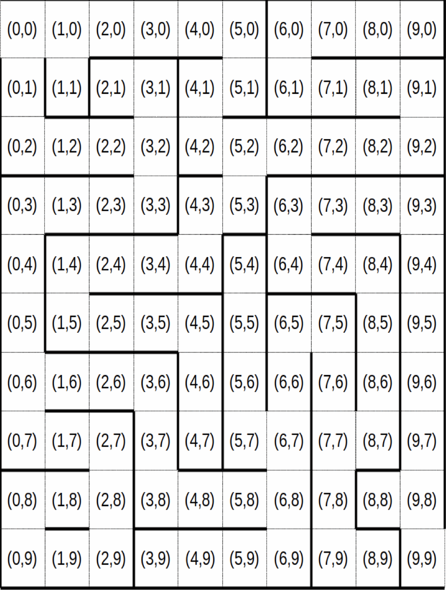

# Maze Solver
This program will take in string that specifies the walls of a maze by the square. Each substring seperated by whirespace represents a square within the maze. This Program solves a 10x10 maze that starts at row 0 and col 0 and ends at row 9 and col 9. This program used a stack to track the path to the end. The stack is printed out at the end of the program for the user to see the solution to the maze. 

when using this program enter the maze imput in one line.

## Example Input:
    lu u ud ud ud ur lu ud ud urd lr lrd lud ur lu rd ld ud ud ur ld ud ud r ld u ud ud ud rd lu ud ud rd lu rd lu ud ud ur lr lu ud ud rd lur ld ud ur lr lr ld ud ud ur lr lu ur lr lr l ud ud ur lr lr lr lr lr lr ld ud ur lr lrd ld r l rd lr lu ud r ld ud ud r lr lud r ld ud rd lud ud ud rd ld urd ldr
Each string in the input is made up of the chars 'l', 'u', 'r', and/or 'd' (left, right, up, and down). These letters represend the walls of the square that it represents.
This means that the 3rd srring in the input will represent 3,0 in the maze and the 100th string will represent 9,9. All strings must be seperated by whitespace

 ## Output:
    (9 9)
    (8 9)
    (7 9)
    (6 9)
    (5 9)
    (4 9)
    (3 9)
    (3 8)
    (3 7)
    (3 6)
    (4 6)
    (4 7)
    (4 8)
    (5 8)
    (6 8)
    (7 8)
    (7 7)
    (6 7)
    (5 7)
    (5 6)
    (6 6)
    (7 6)
    (8 6)
    (8 5)
    (8 4)
    (8 3)
    (7 3)
    (6 3)
    (6 2)
    (6 1)
    (6 0)
    (5 0)
    (4 0)
    (3 0)
    (3 1)
    (3 2)
    (3 3)
    (2 3)
    (2 2)
    (2 1)
    (2 0)
    (1 0)
    (0 0)
## The Example Maze 
Path starts at 0,0 and ends at 9,9

